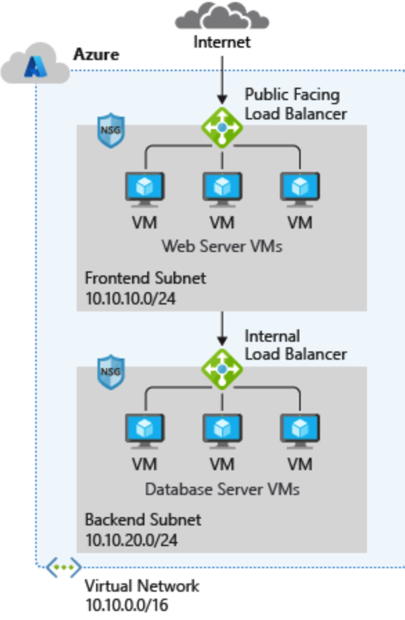
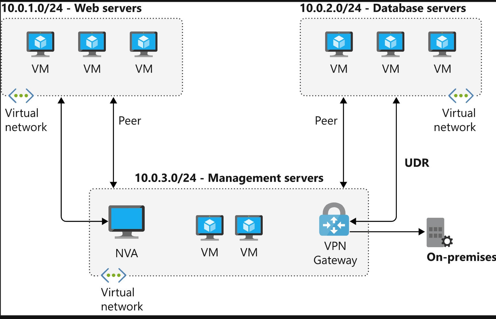
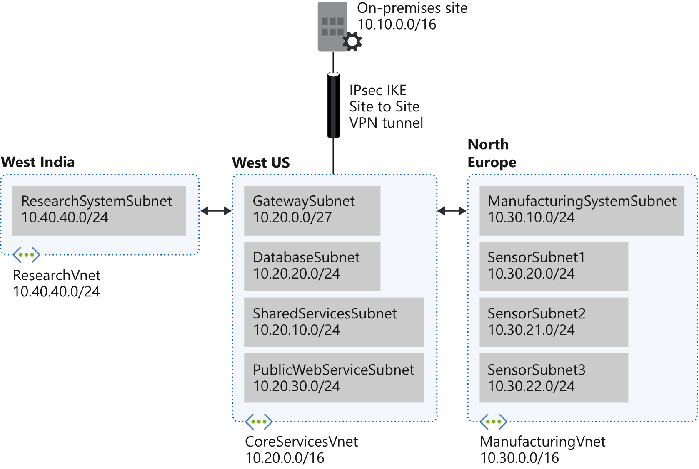

# Configure and manage virtual networks

---

## Table of Contents

- [Pre-requisites](#pre-requisites)
- [Introduction](#introduction)
- [Network Security Groups (NSG)](#network-security-groups-nsg)
- [Application Security Groups (ASG)](#application-security-groups-asg)
- [Virtual Network Peering](#virtual-network-peering)
- [Routing](#routing)
- [Load Balancer](#load-balancer)
- [IP Addressing](#ip-addressing)
- [Azure DNS](#azure-dns)
- [Azure Network Watcher](#azure-network-watcher)
- [References and further reading](#references-and-further-reading)

---

## Pre-requisites

- Understanding of Azure fundamentals
- An Azure account with an active subscription (Free tier is enough). Sign up or login to your Azure account [here](https://azure.microsoft.com/en-us/free/)
- Basic knowledge of networking concepts including subnets and IP(Internet Protocol) addresses.

---

## Introduction

- A virtual network is like a digital version of a physical network. Azure Virtual Network allow different Azure resources to securely communicate with each other, the internet, and on-premises networks. 

- When you create a virtual network, your services and virtual machines within your virtual network can communicate directly and securely with each other in the cloud. You can still configure endpoint connections for the virtual machines and services that require internet communication, as part of your solution. 

- VNs must live within subscription and region, but can span multiple availability zones within that region. You can also connect virtual networks to each other, enabling resources in either virtual network to communicate with each other. This connection is called `virtual network peering`. You can also connect virtual networks to on-premises networks, using a `VPN Gateway` or `ExpressRoute`.

 A typical Azure network design usually has these components:

- Virtual networks
- Subnets
- Network security groups
- Firewalls
- Load balancers

- **Subnets**: A virtual network is your network in the cloud. After creating a virtual network, You can `divide` your virtual network into multiple `subnets`. Each subnet contains a portion of the `private` IP-address space assigned to your virtual network. Subnets enable you to segment the virtual network IP address into one or more sub-networks and allocate a portion of the virtual network's address space to each subnet. You can then deploy Azure resources in a specific subnet and IP-Address assigned to them through `DHCP`. Azure reserves `five` IP addresses, The first four addresses(.0, .1, .2, .3) and the last address(.255) are reserved.
By default, all subnets in an Azure virtual network can communicate with each other. However, you can use a network security group to deny communication between subnets. Regarding sizing, the smallest supported subnet uses a /29 subnet mask, and the largest supported subnet uses a /2 subnet mask. The smallest subnet has eight IP addresses, and the largest subnet has 1,073,741,824 IP addresses.

- How the Counting Occurs: Counting within a subnet follows a sequential pattern. Let's break down the increments for 10.3.0.0/16:

1. `/16` indicates that the first 16 bits are the network part of the address, leaving the remaining bits for host addresses. `(8bits.8bits.8bits.8bits)`
2. Firtst IP Address: `10.3.0.0` , Last IP Address: `10.3.255.255`
3. Azure reserves the `first 4` IP addresses and the `last` IP address in each subnet. The first IP address is the network address `10.3.0.0`, the second IP address is reserved for the Azure service `10.3.0.1`, the third IP address is reserved for the Azure DNS `10.3.0.2`, the fourth is reserved for future use `10.3.0.3` and the last IP address is the broadcast address `10.3.255.255`.
4. Start from 10.3.0.0 and increment by 1.
5. The next address is `10.3.0.1`.
6. This continues up to `10.3.0.255`.
7. After `10.3.0.255`, the next address is `10.3.1.0`, then `10.3.1.1` and this continues up to `10.3.1.255`.
8. After `10.3.1.255`, the next address is `10.3.2.0`, then `10.3.2.1` and this continues up to `10.3.2.255`.
9. This pattern continues until `10.3.255.255`.

- **Static IP addresses**: Static addresses are assigned when a `public IP address` is created. Static addresses aren't released until a public IP address resource is deleted. If the address isn't associated to a resource, you can change the assignment method after the address is created. If the address is associated to a resource, you might not be able to change the assignment method. You select and assign any unassigned or unreserved IP address in the subnet's address range.
Suppose a subnet's address range is 10.0.0.0/16, and addresses 10.0.0.4 through 10.0.0.9 are already assigned to other resources. In this scenario, you can assign any address between 10.0.0.10 and 10.0.255.254.

- **Dynamic IP addresses**: Dynamic addresses are assigned after a public IP address is associated to an Azure resource and is started for the first time. Dynamic addresses can change if a resource such as a virtual machine is stopped (deallocated) and then restarted through Azure. The address remains the same if a virtual machine is rebooted or stopped from within the guest OS. When a public IP address resource is removed from a resource, the dynamic address is released. Azure assigns the next available unassigned or unreserved IP address in the subnet's address range. Dynamic assignment is the default allocation method. Suppose addresses 10.0.0.4 through 10.0.0.9 are already assigned to other resources. In this case, Azure assigns the address 10.0.0.10 to a new resource.

### Steps to Create a Virtual Network

1. Navigate to the Azure portal and search for `Virtual networks`.
2. Click on `+ Create` to create a new virtual network.
3. Fill in the required basic details like `Name`, `Region`.
4. Configure security settings according to your requirements.
5. Configure your virtual network address space with the IPv4 and IPv6 addresses and subnets you need.
   - Define the address space of your virtual network with one or more IPv4 or IPv6 address ranges. 
   - Create subnets to segment the virtual network address space into smaller ranges for use by your applications. 
   - When you deploy resources into a subnet, Azure assigns the resource an IP address from the subnet.
6. Review and create the virtual network.

---

## Network Security Groups (NSG)

Network security groups (NSGs) are a simple way to filter network traffic `to` and `from` Azure resources in an Azure virtual network. Each network security group contains security rules that allow or deny inbound network traffic to, or outbound network traffic from, several types of Azure resources. You can assign network security groups to a subnet and create a protected screened subnet (also referred to as a `demilitarized zone or DMZ`). A DMZ acts as a buffer between resources within your virtual network and the internet.

### Steps to Create a Network Security Group

* Azure creates default rules in a Security Group. Which allow `inbound` trafic only from your `Virtual Network and Load Balancer`, and `outbound` traffic to the `Internet and Virtual Network`. You can add more security rules to a network security group and select from a large variety of communication services, including HTTPS, RDP, FTP, and DNS, by specifying conditions for any of the following settings:
    - **Service** : The service specifies the destination protocol and port range for this rule. You can choose a predefined service, like RDP or SSH, or provide a custom port range
    - **Priority** : The priority of the rule. `The lower the number, the higher the priority`. The priority must be unique for each rule in the collection.
    - **Source (Any, IP addresses, Service tag)** : Controls `Inbound` traffic. Can be an IP address, a range of IP addresses, an application security group or a service tag. `A service tag represents a group of IP address prefixes from a given Azure service`.
    - **Destination (Any, IP addresses, Virtual network)** : Controls `Outbound` traffic. Properties similar to Source.
    - **Port** : The port number or range of port numbers for this rule. You can specify a single port number, a range of port numbers, or a combination of both.
    - **Protocol (Any, TCP, UDP)** : The protocol that this rule applies to. You can specify TCP, UDP, or Any.
    - **Action (Allow or Deny)** : The action to take when the rule matches. The action can be Allow or Deny. The `default action is to deny traffic`, and it takes precedence over the allow action.
    - **Description** : A description for this rule. Restricted to 140 characters.
    - **Name** : The name of the rule. Restricted to 80 characters.

* Each security rule is assigned a Priority value. All security rules for a network security group are processed in priority order. The lower the number, the higher the priority. The first rule that matches the traffic is applied, regardless of whether it allows or denies the traffic. If no rule matches, the default rule is applied. It's a good practice to leave gaps in your priority numbering, such as 100, 200, 300, and so. The gaps in the numbering allow you to add new rules without having to edit existing rules.

* You can't remove the default security rules. You can override a default security rule by creating another security rule that has a higher Priority setting for your network security group. By default, Azure allows virtual machines in the same subnet to send traffic to each other (referred to as intra-subnet traffic). You can prohibit intra-subnet traffic by defining a rule in the network security group to deny all inbound and outbound traffic. This rule prevents all virtual machines in your subnet from communicating with each other.

* For inbound traffic, Azure first checks the NSG rules associated with the subnet to ensure that the traffic is allowed to enter the subnet, After the traffic passes the subnet rules, Azure then checks the NSG rules associated with the network interface(NIC)`(point of connection, like an Network card with an associated IP adress)` of the target VM or resource. This second check ensures that the traffic is specifically allowed to reach the intended resource. The reverse process occurs for outbound traffic. This process ensures layered security for your resources.

### Scenario: 
- Create and configure network security groups.
- `Associate` network security groups to virtual machines.
- Deny and allow access to the virtual machines by using network security groups.

### Solution:
1. Create a virtual machine.
    - Create a Windows Server virtual machine.
    - Select `Inbound port rules` as none, this excludes the basic rule of Remote Desktop Protocol (RDP)connection port 3389 aswell as any other connection.
    - On the `Networking` tab, select `none` for the network security group. This action ensures that the virtual machine has no network security group associated with it.
    - On disable `Boot diagnostics` to allow the virtual machine to boot up without requiring some additional configurations.
    - Verify the virtual machine is created.
    - Review the Inbound port rules tab, and note there are no network security groups associated with the virtual machine.

2. Create a network security group and associate the group with the virtual machine.
    - Create a network security group.
    - Go to `Network Interfaces` and associate the network security group with the virtual machine network interface (NIC). This action applies the network security group rules to the virtual machine through the NIC, not subnet.

3. Create a security rule to allow RDP access to the virtual machine.
    - Try to connect to the virtual machine using RDP. The connection should fail because the network security group denies the RDP connection.
    - Add an inbound port rule to allow RDP to the virtual machine on port 3389, TCP protocol, priority 300 and name it `Allow-RDP`.
    - Verify that the security rule is applied to the network security group associated with the virtual machine and you can now connect to the virtual machine using RDP.
    - To use RDP download the RDP file from the Azure portal and open it with the Remote Desktop Connection application.

4. Configure an outbound security port rule to deny internet access.
    - You already have an outbound security rule that allows all traffic to the internet. Remember this is a default rule that cant be reomved. Verify that you can access the internet from the virtual machine.
    - Add an outbound security rule to deny all traffic to the internet. This rule should then have a higher priority than the default rule to be able to override it.
    - Verify that you can no longer access the internet from the virtual machine.

---

## Application Security Groups (ASG)
Application Security Groups (ASGs) let you organize virtual machines into groups based on workload or function, eg. Webservers, Databases. Instead of managing security rules for each VM individually, you can apply security rules to the entire group having same functions. This means you can define a security policy once for an `application group`, and it applies to all VMs within that group. With this You can define fine-grained network security policies based on workloads, rather than explicit IP addresses. ASGs enable you to configure network security as a natural extension of an application's structure, allowing you to group virtual machines with similar security requirements. 

### Scenario:
- We have six virtual machines in our configuration with two web servers and two database servers.
- Customers access the online catalog hosted on our web servers.
- The web servers must be accessible from the internet over HTTP port 80 and HTTPS port 443.
- Inventory information is stored on our database servers.
- The database servers must be accessible over HTTPS port 1433.
- Only our web servers should have access to our database servers.

**Solution**:
1. Create Application Security Groups for the Virtual Machines
    - Create an application security group named **WebASG** to group our web server machines.
    - Create an application security group named **DBASG** to group our database server machines.

2. Assign the Network Interfaces for the Virtual Machines
    - For each virtual machine server, assign its NIC to the appropriate application security group.

3. Create the Network Security Group and Security Rules
    * Rule 1
        - **Priority**: 100
        - **Description**: Allow access from the internet to machines in the WebASG group from HTTP port 80 and HTTPS port 443.
        - **Note**: Rule 1 has the lowest priority value, so it has precedence over the other rules in the group. Customer access to our online catalog is paramount in our design.

    * Rule 2
        - **Priority**: 110
        - **Description**: Allow access from machines in the WebASG group to machines in the DBASG group over HTTPS port 1433.

    * Rule 3
        - **Priority**: 120
        - **Description**: Deny access from anywhere to machines in the DBASG group over HTTPS port 1433.

**Note**: The combination of Rule 2 and Rule 3 ensures that only our web servers can access our database servers. This security configuration protects our inventory databases from outside attack.

---

## Virtual Network Peering

Virtual network peering enables you to seamlessly connect two Azure virtual networks. Once peered, the virtual networks appear as one, for connectivity purposes. The traffic between the virtual machines in the peered virtual networks is routed through the Microsoft backbone infrastructure, much like traffic is routed between virtual machines in the same virtual network, through private IP addresses only. Virtual network peering provides a low-latency, high-bandwidth connection between resources in different virtual networks. 
- In any networks you connect through virtual network peering, VPN, or ExpressRoute, assign different address spaces that don't **`overlap`**. This is same with on-premises networks. If the address spaces overlap, the traffic won't be routed correctly. For example, you can't use 192.168.0.0/16 on your on-premises network and use 192.168.10.0/24 on your Azure virtual network. These ranges both contain the same IP addresses so traffic can't be routed between them.
- Peering works well across same regions, different regions, subscriptions and even different tenants(Needs network admin permissions from both tenants).
- When you create a virtual network peering connection with Azure PowerShell or Azure CLI, only one side of the peering gets created. To complete the virtual network peering configuration, you'll need to configure the peering in reverse direction to establish connectivity. When you create the virtual network peering connection through the `Azure portal`, the configuration for both side is completed at the same time.

**Gateway transit**: Peering is `non-transitive`. Suppose, for example, that your three virtual networks (A, B, C) are peered like this: A <-> B <-> C. Resources in A can't communicate with resources in C because that traffic can't transit through virtual network B. You can enable and add `gateway transit` to the B network. The B network now acts as a hub, and resources in A can communicate with resources in C. `Gateway transit` allows the peered virtual networks to use the `VPN gateway` in the peering virtual network. This feature is useful when you have a central network that you want to connect to multiple `spoke networks`. The spoke networks can use the `VPN gateway` or a `network virtual appliance (NVA)` in the central network to establish a connection to `on-premises` resources. The central network acts as a `hub`, while other networks act as `spokes`. This mechanism is known as **`hub-and-spoke topology`**.
- Other ways to extend the capabilities of your peering for resources and virtual networks outside your peering network, You can implement these mechanisms and create a multi-level hub and spoke architecture. These options can help overcome the limit on the number of virtual network peerings per virtual network.: 
    - **`User-defined routes(UDRs)`** : Virtual network peering enables the next hop in a user-defined route to be the IP address of a virtual machine in the peered virtual network, or a VPN gateway.
    - **`Service Chaining`** : Service chaining is a method of connecting multiple virtual network appliances to create a chain of services. Service chaining is used to direct traffic from one virtual network to a virtual appliance or gateway. A user-defined route defines the peered networks.
    - **`Transit VNet`** : A transit virtual network is a virtual network that acts as a hub to route traffic between multiple virtual networks. The transit virtual network can be used to route traffic between virtual networks that are peered with the transit virtual network. The transit virtual network can also be used to route traffic between virtual networks that are not peered with each other. The transit virtual network can be used to route traffic between virtual networks that are in the same region or in different regions. The transit virtual network can be used to route traffic between virtual networks that are in the same subscription or in different subscriptions. The transit virtual network can be used to route traffic between virtual networks that are in the same tenant or in different tenants.

- **Scenario**: 
    - There are two offices, New York and Boston, in one region.
    - There's one office, Seattle, in another region.
    - All the VMs in the offices need to be networked together so they can share information.

- **Solution**:
    - Create a virtual network in each office.
    - Create a VM in each virtual network.
    - Create a `local` network peering between New York and Boston virtual networks.
    - Create a `global` network peering between New York and Seattle virtual networks.
    - Verify that the New York VM can communicate with both the Boston and Seattle VMs.
    - Verify that Boston and Seattle VMs `can not` communicate with each other as peering is `non-transitive`.
    - Peer the Boston and Seattle virtual networks.
    - Verify that the Boston and Seattle VMs can communicate with each other.

---

## Routing

### System routes

Network traffic in Azure is automatically routed across Azure subnets, virtual networks, and on-premises networks. `System routes` control this routing. Azure uses system routes to direct network traffic between virtual machines, on-premises networks, and the internet. They're assigned by default to each subnet in a virtual network. With these system routes, any Azure virtual machine that is deployed into a virtual network can communicate with any other in the network. These virtual machines are also potentially accessible from on-premises through a hybrid network or the internet. Information about the system routes is recorded in a route table. 

* Azure uses system routes to control traffic for virtual machines in several scenarios:
    - Traffic between virtual machines in the same subnet
    - Traffic between virtual machines in different subnets in the same virtual network
    - Traffic from virtual machines to the internet
    - A route table contains a set of rules (called routes) that specifies how packets should be routed in a virtual network.

* Route tables record information about the system routes, where the tables are associated to subnets.

* Each packet leaving a subnet is handled based on the associated route table.

* You can create multiple route tables in Azure. Each route table can be associated with one or more subnets. A subnet can only be associated with one route table.

* Packets are matched to routes by using the destination. The destination can be an IP address, a virtual network gateway, a virtual appliance, or the internet.

* When a matching route can't be found, the packet is dropped.

### User-defined routes (UDRs)

You can't create or delete system routes, but you can override the system routes by adding custom routes to control traffic flow to the next hop. User-defined routes (UDRs) enable you to override Azure's default system routes and control the routing behavior of network traffic. UDRs control network traffic by defining routes that specify the next hop of the traffic flow. The next hop can be;
- `Virtual network gateway`;Use to indicate when you want routes for a specific address to be routed to a virtual network gateway. The virtual network gateway is specified as a VPN for the next hop type.
- `Virtual network`;Use to override the default system route within a virtual network.
- `Internet`;Use to route traffic to a specified address prefix that is routed to the internet.
- **`Network virtual appliance (NVA)`**;A virtual appliance is typically a firewall device used to analyze or filter traffic that is entering or leaving your network. They are virtual machines that control the flow of network traffic by controlling routing. It acts as a router that forwards requests between subnets on the virtual network. You can specify the private IP address of a Network Interface Card (NIC) attached to a virtual machine so that IP forwarding can be enabled, Or you can provide the private IP address of an internal load balancer. With the `microsegmentation approach`, you can create dedicated subnets for the firewall(NVA) and then deploy web applications and other services in other subnets. All traffic is routed through the firewall and inspected by the NVAs. You'll enable forwarding on the virtual-appliance network interfaces to pass traffic that is accepted by the appropriate subnet. Click [here](https://learn.microsoft.com/en-us/training/modules/control-network-traffic-flow-with-routes/4-network-virtual-appliances) to learn more about `NVA`
- `None`;Use to drop traffic sent to a specified address prefix.

Similar to system routes, UDRs also access route tables.

**Scenario**:
Suppose you have a virtual machine that performs a network function like routing, firewalling, or WAN optimization. You want to direct certain subnet traffic to the NVA. To accomplish this configuration, you can;
- place an NVA between subnets or between one subnet and the internet. The subnet can use a UDR to access the NVA and then the internet. 
- The subnet can use another UDR and NVA to access the back-end subnet.

### Service Endpoints

- A virtual network service endpoint provides the `identity` of your virtual network to the Azure service, like `Azure Storage` or `Azure SQL Database`. 
- The Azure service uses the identity to restrict access to only the virtual network. Service endpoints are a secure and direct connection between a virtual network and an Azure service. 
- Service endpoints extend your virtual network private address space to the Azure service, over a direct connection. The connection is secure because it doesn't go over the internet. Service endpoints are powered by the Azure `backbone` network, a global network that Microsoft uses to connect its datacenters. 
- Currently, Azure service traffic from a virtual network uses public IP addresses as source IP addresses. With `service endpoints`, service traffic switches to using `virtual network private addresses` as the source IP addresses when accessing the Azure service, from a virtual network. By adding virtual network rules to the resources, this switch from `public IP addresses` to `private IP addresses` provides the following benefits:

    - **Security**: By using private IP addresses, you can restrict access to the Azure service to only your virtual network. This restriction is achieved by using network security group rules that allow traffic only from your virtual network.
    - **Optimized routing**: By using private IP addresses, traffic from your virtual network to the Azure service remains on the Microsoft Azure backbone network. This routing is optimized for performance and lower latency. Through `Force-Tunneling`, Routes in your virtual network that force internet traffic to your on-premises or network virtual appliances also typically force Azure service traffic to take the same route as the internet traffic. You can force all traffic from your virtual network to the Azure service to use the Microsoft Azure backbone network.
    - **Simplified network configuration**: By using private IP addresses, you can simplify your network configuration by removing the need for public IP addresses in your virtual network.

**Private links**: Azure Private Link provides private connectivity from a virtual network to Azure platform as a service (PaaS), customer-owned, or Microsoft partner services. Your Azure virtual machines can access your storage account directly from the private address space and deny access from a public virtual machine. As you enable service endpoints, Azure creates routes in the route table to direct this traffic.
- Private Link simplifies the network architecture and secures the connection between endpoints in Azure by keeping data on the Microsoft network, no public access. 
- The service provider and the consumer can be in the same region or in different regions. 
- The service provider can be in a different Azure subscription or tenant. 
- Services delivered on Azure can be brought into your private virtual network by mapping your network to a private endpoint. 
- Private Link provides connectivity between virtual networks, services, and organizations.
- All traffic to the service can be routed through the private endpoint. No gateways, NAT devices, Azure ExpressRoute or VPN connections, or public IP addresses are required.

**Note**: It's easy to add a service endpoint to the virtual network. In the Azure portal, you select the Azure service for which to create the endpoint. Adding service endpoints can take up to 15 minutes to complete. Each service endpoint integration has its own Azure documentation page.

**Border Gateway Protocol (BGP)**: BGP is a standardized exterior gateway protocol that exchanges routing information between autonomous systems (ASes), such as different host gateways. With `BGP` you can exchange routes between your `on-premise network gateway` and `azure network gateway`. Typically, you use BGP to advertise on-premises routes to Azure when you're connected to an Azure datacenter through Azure ExpressRoute. You can also configure BGP if you connect to an Azure virtual network by using a VPN site-to-site connection.

**Routing Priority**: When you have multiple routes that apply to the same traffic, Azure uses the route with the lowest priority value. The priority value is a number between 0 and 4095. The lower the number, the higher the priority. If two routes have the same priority, Azure uses the route with the lowest address prefix length. The address prefix length is the number of bits in the address prefix. For example, a prefix length of 24 means that the first 24 bits of the address are the network address, and the remaining bits are the host address. For example, a message is sent to the IP address 10.0.0.2, but two routes are available with the 10.0.0.0/16 and 10.0.0.0/24 prefixes. Azure selects the route with the 10.0.0.0/24 prefix because it's more specific. If there are multiple routes with the same address prefix, Azure selects the route based on the type in the following order of priority:
1. User-defined routes
2. BGP routes
3. System routes

### ExpressRoute

- Azure ExpressRoute is a service that enables you to create private connections between Azure datacenters and infrastructure that's on your premises or in a colocation facility. 

- ExpressRoute connections don't go over the public internet, and they offer more reliability, faster speeds, lower latencies, and higher security than typical connections over the internet. 

- In some cases, using ExpressRoute connections to transfer data between on-premises and Azure can yield significant cost savings. 

- To `create an ExpressRoute connection`, you need to work with a connectivity provider to establish a connection between your on-premises network and an ExpressRoute location (an Azure datacenter). The connection can be an `Ethernet connection` or a `Multiprotocol Label Switching` (MPLS) connection. The connection provider will then establish a connection between the ExpressRoute location and the Azure datacenter.

- `ExpressRoute Global Reach` enables you to connect your various on-premise centers together through Azure. This feature allows you to connect your on-premise centers to each other through Azure, even if they are in different regions. This feature is useful when you have multiple on-premise centers that need to communicate with each other. You can use ExpressRoute Global Reach to connect your on-premise centers to each other through Azure. 

- In the Azure portal, you can create an ExpressRoute circuit. An ExpressRoute circuit is a logical connection between your on-premises network and an Azure virtual network. You can create multiple ExpressRoute circuits in the same subscription. Each ExpressRoute circuit can be associated with one or more virtual networks. You can also associate multiple ExpressRoute circuits with the same virtual network.When you create an ExpressRoute circuit, you specify the following settings:

    - **Circuit name**: A name for the ExpressRoute circuit
    - **Provider**: The connectivity provider that you're using to establish the connection
    - **Peering location**: The location where the ExpressRoute circuit is connected to the Azure network
    - **Bandwidth**: The bandwidth of the ExpressRoute circuit
    - **SKU**: The service level agreement (SLA) for the ExpressRoute circuit
    - **Routing domain**: The routing domain that the ExpressRoute circuit uses
    - **Authorization key**: The key that's used to authenticate the connection between your on-premises network and the ExpressRoute circuit

- ExpressRoute gateways are used to connect virtual networks to ExpressRoute circuits, establishing a private peering. You can create an ExpressRoute gateway in the Azure portal. When you create an ExpressRoute gateway, you specify the following settings:
    - **Name**: A name for the ExpressRoute gateway
    - **Virtual network**: The virtual network that the ExpressRoute gateway is associated with
    - **Gateway subnet**: The subnet that the ExpressRoute gateway uses
    - **Public IP address**: The public IP address that the ExpressRoute gateway uses
    - **ExpressRoute circuit**: The ExpressRoute circuit that the ExpressRoute gateway connects to
    - **Authorization key**: The key that's used to authenticate the connection between your on-premises network and the ExpressRoute circuit

### Point-to-Site VPN and Site-to-Site VPN

* A Point-to-Site (P2S) VPN is a secure connection between a client computer and an Azure virtual network. It is typically used to connect individual devices to an Azure network, such as when employees need to securely connect to the corporate network from remote locations. Key Features:
    - Individual Connection: Ideal for remote users who need to connect to the Azure network from anywhere over the internet.
    - Client-Based: Users install VPN client software on their devices to establish a connection.
    - Secure Connection: Uses SSL/TLS for encryption, providing a secure tunnel for data.
    - Scalability: Suitable for smaller scale deployments with fewer users.

* Site-to-Site (S2S) VPN is a secure connection between an on-premises location and an Azure virtual network. It is typically used to connect an entire network to an Azure network, such as when you need to connect multiple branch offices to an Azure virtual network. Key Features:
    - Network Connection: Ideal for connecting on-premises networks to Azure virtual networks.
    - Gateway-Based: Uses a VPN gateway to establish a secure connection between the on-premises network and the Azure virtual network.
    - Secure Connection: Uses IPsec/IKE for encryption, providing a secure tunnel for data.
    - Scalability: Suitable for larger scale deployments with multiple users and devices.

Steps to create site-to-site VPN usually starts in the portal:
1. Create a virtual network.
2. Create a gateway subnet
3. Create a VPN gateway.
4. Create a local network gateway.
5. Configure on-premises VPN device.
6. Create a connection.

### Virtual WAN

- Azure Virtual WAN is a networking service that brings many networking, security, and routing functionalities together to provide a single operational interface.

- Virtual WAN allows you to connect your branches to Azure and to each other. It also allows you to connect your branches to the internet and to your on-premises network.

- Virtual WAN provides the following benefits:
    - **Simplicity**: Virtual WAN provides a single operational interface for all your networking, security, and routing needs.
    - **Security**: Virtual WAN provides security features such as encryption, firewall, and threat protection.
    - **Performance**: Virtual WAN provides high-speed connections between your branches and Azure.
    - **Reliability**: Virtual WAN provides a reliable connection between your branches and Azure.

- Virtual WAN provides the following features:
    - **Site-to-site connectivity**: Virtual WAN provides site-to-site connectivity between your branches and Azure.
    - **Point-to-site connectivity**: Virtual WAN provides point-to-site connectivity between your branches and Azure.
    - **VPN connectivity**: Virtual WAN provides VPN connectivity between your branches and Azure.
    - **ExpressRoute connectivity**: Virtual WAN provides ExpressRoute connectivity between your branches and Azure.
    - **Security**: Virtual WAN provides security features such as encryption, firewall, and threat protection.
    - **Routing**: Virtual WAN provides routing features such as BGP and route tables.
    - **Monitoring**: Virtual WAN provides monitoring features such as network performance monitoring and network diagnostics.

---

## Load Balancer

Azure Load Balancer delivers high availability and network performance to your applications. Administrators use load balancing to efficiently distribute incoming network traffic across back-end servers and resources. A load balancer is implemented by using load-balancing rules and health probes. Load balancers can be configured to support -
* `external`: Normally used for internet-facing applications, Example: Internet client send webpage requests to the public IP address of a web application. The load balancer distributes the requests to the virtual machines in the back-end pool.

or 

* `internal`: For internal applications within an Azure network, Example: VM server receives request from Internet client, VM server Need to communicate with a database server. The load balancer distributes the requests to the virtual machines hosting the back-end SQL servers whcih should all be in the same subnet.

**To implement a load balancer, you configure four components**:

- Front-end IP configuration: The public IP address that receives the incoming network traffic.
- Back-end pools: The virtual machines that receive the incoming network traffic, including Azure Virtual Machines or instances in Azure Virtual Machine Scale Sets.
- Health probes: The health probes that monitor the health of the virtual machines in the back-end pool.
- Load-balancing rules: The rules that define how the incoming network traffic is distributed to the virtual machines in the back-end pool.

When you create an Azure load balancer in the Azure portal, you select the type of load balancer to create (internal or public) and the Stock Keeping Unit (SKU). The SKU type that you select determines which endpoint configurations are supported for the pool along with the number of pool instances allowed(`The pool is the collection of virtual machines that receive the incoming network traffic at the backend`).Azure Load Balancer supports three SKU options: 

- Basic, can be upgraded to the Standard SKU. Allows up to 300 pools and 1000 rules.
- Standard, essentially a superset of Basic offering an expanded and more granular feature set than the Basic SKU. Allows up to 1000 pools and 1000 rules.
- Gateway, supports high performance and high availability scenarios with third-party network virtual appliances (NVAs).

**Health Probes**: Health probes are used to monitor the health of your applications and the virtual machines in the back-end pool. The health probe periodically checks the health of the virtual machines by sending a request to the virtual machine and waiting for a response. If the virtual machine responds to the probe, it's considered healthy. If the virtual machine doesn't respond to the probe, it's considered unhealthy. The load balancer stops sending network traffic to unhealthy virtual machines.
To configure a probe, you specify values for the following settings:
- Port: Back-end port number that the health probe monitors
- URI: URI for requesting the health status from the backend
- Protocol: Protocol used for the health probe (HTTP, TCP, or HTTPS). For HTTP, a virtual machine instance is considered healthy if it responds with an HTTP 200 message within the specified timeout period (default is 31 seconds). 
- Interval: Amount of time between probe attempts (default is 15 seconds)
- Unhealthy threshold: Number of failures that must occur for the instance to be considered unhealthy 

**Load Balancing Rules**: Load-balancing rules define how the incoming network traffic is distributed to the virtual machines in the back-end pool. By default, Azure Load Balancer distributes network traffic equally among multiple virtual machines. The load balancer uses a 5-tuple hash to map traffic to the available servers. The 5-tuple hash includes the:

- `source IP address`: The IP address of the client that sent the request
- `source port`: The port number used by the client
- `destination IP address`: The IP address of the load balancer
- `destination port`: The port number used by the client to connect to the load balancer
- `protocol type`: The protocol used by the client to connect to the load balancer TCP or UDP

**To define a rule in the Azure portal, you configure several settings:**

- IP version (IPv4 or IPv6)
- Front-end IP address, *Port, and Protocol (TCP or UDP)
- Back-end pool and Back-end port
- Health probe
- **Session persistence**: Session persistence specifies how to handle traffic from a client. By default, successive requests from a client go to any virtual machine in your pool when the `None` setting is used. Alternatively, you can configure the load balancer to use the `Client IP` setting, which ensures that all requests from a particular client go to the same virtual machine in the pool. This is also referred to as `Source IP Affinity`.
    - `None (Default)`: Successive requests from a client can go to any virtual machine in the pool.
    - `Client IP (Source IP Affinity)`: Ensures all requests from a particular client go to the same virtual machine.
    - `Tuple Hashing`:Using tuple hashing, the load balancer can direct traffic to the same virtual machine based on various combinations of packet information:
        - **2-Tuple Hash**: Uses the source IP address and destination IP address.
        - **3-Tuple Hash**: Uses the source IP address, source port, and destination IP address.
        - **5-Tuple Hash**: Uses the source IP address, source port, destination IP address, destination port, and protocol.

Maintaining session persistence helps ensure that a client's requests are consistently handled by the same virtual machine, providing a seamless user experience. This can be particularly important for applications requiring stateful sessions like shopping carts or login sessions.

### Application Gateway

Azure Application Gateway is a load balancer for `web traffic`. Administrators implement an application gateway to manage traffic to their web apps. Azure Application Gateway offers two primary methods for routing traffic:

- **Path-based routing**: sends requests with different URL paths to different pools of back-end servers. Each pool can contain a different set of servers. For example, you can route requests for `/images` to one set of servers and requests for `/video` to another set of servers.

- **Multi-site routing**: configures more than one web application on the same application gateway instance. Each web application can have its own back-end pool of servers. For example, you can route requests for `www.contoso.com` to one set of servers and requests for `www.fabrikam.com` to another set of servers.

- You can configure your application gateway to redirect traffic. For example, you can redirect traffic from HTTP to HTTPS. You can also configure the application gateway to rewrite URLs. For example, you can rewrite URLs to change the path of a request.

- You can implement Application Gateway to rewrite HTTP headers. For example, you can add, remove, or update HTTP headers. You can also implement Application Gateway to add a custom header to a request. For example, you can add a header that contains the client's IP address.

- Application Gateway allows you to create custom error pages instead of displaying default error pages. You can use your own branding and layout by using a custom error page.

---

## IP Addressing

IP addressing is a critical component of network design. IP addresses are used to identify devices on a network. An IP address is a unique identifier for a device on a network. IP addresses are used to route traffic between devices on a network. 

**Considerations for IP Addressing**:

- **Public IP addresses**: Public IP addresses are used to communicate with devices on the internet. Public IP addresses are assigned by the Internet Assigned Numbers Authority (IANA). Public IP addresses are unique and can't be duplicated. Public IP addresses are routable on the internet. 

- **Private IP addresses**: Private IP addresses are used to communicate with devices on a private network. Private IP addresses are not routable on the internet. 

- **Dynamic IP addresses**: Dynamic IP addresses are assigned by a DHCP server. Dynamic IP addresses are temporary and can change. 

- **Static IP addresses**: Static IP addresses are manually assigned to a device. Static IP addresses are permanent and don't change.

- **Dynamic Host Configuration Protocol (DHCP)**: The Dynamic Host Configuration Protocol (DHCP) is a network management protocol used to automatically assign IP addresses to devices on a network. DHCP assigns IP addresses to devices when they connect to the network. DHCP assigns IP addresses from a pool of available addresses. DHCP can also assign other network configuration settings, such as the subnet mask and default gateway.

- **Subnets**: A subnet is a range of IP addresses in your network. 

- **CIDR notation**: CIDR notation is a compact representation of an IP address and its associated network mask. CIDR notation is used to specify the number of bits in an IP address that represent the network portion of the address. CIDR notation is used to specify the number of bits in an IP address that represent the network portion of the address. CIDR notation is used to specify the number of bits in an IP address that represent the network portion of the address. CIDR notation is used to specify the number of bits in an IP address that represent the network portion of the address.

Before planning your network IP address scheme, you must gather the requirements for your infrastructure. These requirements also will help you prepare for future growth by reserving extra IP addresses and subnets.

Here are two of the questions you might ask to discover the requirements:

- How many devices do you have on the network?
- How many devices are you planning to add to the network in the future?

When your network expands, you don't want to redesign the IP address scheme. Here are some other questions you could ask:

- Based on the services running on the infrastructure, what devices do you need to separate?
- How many subnets do you need?
- How many devices per subnet do you have?
- How many devices are you planning to add to the subnets in future?
- Are all subnets going to be the same size?
- How many subnets do you want or plan to add in future?

**Scenario**:
Your organization has three virtual networks in Azure: CoreServicesVnet, ManufacturingVnet, and ResearchVnet. Each virtual network has unique requirements for IP address space. You need to plan the IP address space for each virtual network. Here are the requirements for each virtual network:

- The `CoreServicesVnet` virtual network is deployed in the US West region. This virtual network has the largest number of resources. It has connectivity to on-premises networks through a VPN connection. This network has web services, databases, and other systems that are key to business operations. Shared services, such as domain controllers and DNS, are located here as well. A large amount of growth is anticipated, so a large address space is necessary for this virtual network.

- The `ManufacturingVnet` virtual network is deployed in the North Europe region, near the location of your organization's manufacturing facilities. This virtual network contains systems for the manufacturing facilities' operations. The organization is anticipating a large number of internal connected devices from which their systems retrieve data (such as temperature) and need an IP address space for expansion.

- The `ResearchVnet` virtual network is deployed in the West India region, near the location of the organization's research and development team that uses this virtual network. The team has a small, stable set of resources with no expectation of future growth. The team needs a few IP addresses for a few virtual machines for their work.

---

## Azure DNS

Azure DNS is a hosting service for DNS domains that provides name resolution using the Microsoft Azure infrastructure. By hosting your domains in Azure, you can manage your DNS records using the same credentials, APIs, tools, and billing as your other Azure services. Azure DNS supports both IPv4 and IPv6 addresses. 

After purchasing a domain name, To host the domain name with Azure DNS, you first need to create a DNS zone for that domain. A DNS zone holds all the DNS entries for your domain. You can create a DNS zone in Azure DNS by using the Azure portal, Azure PowerShell, or the Azure CLI. After you create a DNS zone, you can add DNS records to the zone. DNS records are used to map domain names to IP addresses. 

1. `DNS Zone`: Start by creating a DNS zone, providing the `Domain name`, `subscription`, `resource group and location`. The DNS zone is the container for all the DNS records for a domain. You can create a DNS zone in Azure DNS by using the Azure portal, Azure PowerShell, or the Azure CLI. After you create a DNS zone, you can add DNS records to the zone.

- The name of the zone must be unique within the resource group, and the zone must not exist already. Otherwise, the operation fails
- Where multiple zones share the same name, each instance is assigned different name server addresses. Only one set of addresses can be configured with the domain name registrar.

2. `Get the Name Servers`: After creating a DNS zone, you need to get the name servers for the zone. The name servers are the servers that host the DNS records for your domain. You need to provide these name servers to your domain registrar to delegate the domain to Azure DNS. You can get the name servers for a DNS zone in Azure DNS by using the Azure portal, Azure PowerShell, or the Azure CLI.

3. `Update the Domain Registrar`: After getting the name servers for a DNS zone, you need to update the domain registrar with the name servers. The domain registrar is the company where you purchased the domain name. You need to provide the name servers to the domain registrar to delegate the domain to Azure DNS. After you update the domain registrar with the name servers, Azure DNS can host the DNS records for your domain.

4. `Verify delegation of domain name services`: The next step is to verify that the delegated domain now points to the Azure DNS zone you created for the domain. This process can take as few as 10 minutes, but might take longer.

To verify the success of the domain delegation, query the start of authority (SOA) record. The SOA record is automatically created when the Azure DNS zone is set up. You can verify the SOA record using a tool like `nslookup`.

5. `Configure DNS settings through DNS Records`: After creating a DNS zone, you can add DNS records to the zone. DNS records are used to map domain names to IP addresses.
Azure DNS manages all DNS records using record sets. `A record set (also known as a resource record set)` is the collection of DNS records in a zone that have the same name(apex name/zone name eg. `kalu.com`) and are of the same type. Most record sets contain a single record.  You can add the following types of DNS records to a DNS zone:
    - **A**: Maps a domain name to an IPv4 address.
    - **AAAA**: Maps a domain name to an IPv6 address.
    - **CNAME**: Maps a domain name to another domain name.
    - **MX**: Maps a domain name to a mail server.
    - **NS**: Maps a domain name to a name server. Gets created automatically at the apex of each zone (name = '@'), and gets deleted automatically when the zone gets deleted.
    - **PTR**: Maps an IP address to a domain name.
    - **SOA**: Specifies the start of authority for a DNS zone. SOA records are used to store information about the zone, such as the primary name server for the zone and the email address of the person responsible for the zone. Gets created automatically at the apex of each zone (name = '@'), and gets deleted automatically when the zone gets deleted. 
    - **SRV**: Maps a domain name to a service.
    - **TXT**: Maps a domain name to text information.
- A record set can contain multiple records of the same type. For example, suppose you have already created an A record 'www' in the zone 'kalu.com', pointing to the IP address '134.170.185.46'. To create the second record you would add that record to the existing record set, rather than create an additional record set. You can add, remove, or update records in a record set. 
- The SOA and CNAME record types are exceptions. The DNS standards don't permit multiple records with the same name for these types, therefore these record sets can only contain a single record.

**Apex Domain**: An apex domain is a domain that doesn't contain a subdomain. For example, `contoso.com` is an apex domain. An apex domain is also known as a root domain. An apex domain can't be a CNAME record. A CNAME record is a type of DNS record that maps a domain name to another domain name. An apex domain can have other types of DNS records, such as A records and MX records.

**Azure Alias Record**: An Azure alias record is a type of DNS record that is specific to Azure DNS. An Azure alias record is used to map an apex domain to an Azure resource, such as an `Azure Content Delivery Network (CDN) endpoint`, `A public IP resource`, `Azure Traffic Manager profile`, `A front-door profile`. Alias records also provide support for load-balanced applications in the zone apex. The alias record set supports the following DNS zone record types: `A`, `AAAA`, `CNAME`, and `CNAME`. With alias records you can:

- **Prevents dangling DNS records**: A dangling DNS record occurs when the DNS zone records aren't up to date with changes to IP addresses. Alias records prevent dangling references by tightly coupling the lifecycle of a DNS record with an Azure resource.
- **Updates DNS record set automatically when IP addresses change**: When the underlying IP address of a resource, service, or application is changed, the alias record ensures that any associated DNS records are automatically refreshed.
- **Hosts load-balanced applications at the zone apex**: Alias records allow for zone apex resource routing to Traffic Manager.
- **Points zone apex to Azure Content Delivery Network endpoints**: With alias records, you can now directly reference your Azure Content Delivery Network instance.

An alias record allows you to link the zone apex (wideworldimports.com) to a load balancer. It creates a link to the Azure resource rather than a direct IP-based connection. So, if the IP address of your load balancer changes, the zone apex record continues to work.

---

## Azure Network Watcher

Azure Network Watcher is a regional service that helps you monitor, diagnose, and gain insights into your network infrastructure in Azure. By using features such as IP flow verification, next hop analysis, and connection troubleshooting, you can ensure that your virtual network is functioning optimally. Some of the key features of Azure Network Watcher include:

**Network Performance Monitoring**
- **Connection Monitor**: Monitors connectivity status, latency, RTT( Round Trip Time), hop count between two virtual machines and network topology changes between Azure virtual machines, endpoints and network interfaces.
- **Connection Troubleshoot**: Diagnoses network connectivity issues between two virtual machines or a virtual machine and an endpoint.
- **Azure Monitor Network Insights**: Provides network performance monitoring and diagnostics for Azure virtual machines. Creates a `network map to visualize` detailed network traffic flow and dependencies.
- **Traffic Analytics**: Analyzes and visualizes traffic flow in your Azure virtual network. Traffic Analytics provides insights into traffic flow patterns, helping you identify potential security threats and performance issues. It requires:
    - **Network Watcher**: To collect network traffic data.
    - **Network Security Group (NSG) Flow Logs**: To collect data on network traffic.
    - **Log Analytics workspace**: To store and analyze the data.

* **Network Diagnostics**
    - **IP Flow Verify**: Quickly diagnose connectivity issues from or to the internet, and from or to your on-premises environment. 
        - This feature helps you identify if a `NSG rule is blocking traffic` to or from your virtual machine or the internet.
        - At some point, your virtual machine might be unable to communicate with other resources because of a security rule. You can use the IP flow verify feature to `troubleshoot your NSG rules`. If test runs fail, but the IP flow verify feature doesn't indicate the issue is related to your NSG rules, you need to explore other areas, such as firewall restrictions.
        - You configure the IP flow verify feature with the following properties in the Azure portal:
            - Virtual machine and network interface
            - Local (source) port number
            - Remote (destination) IP address, and remote port number
            - Communication protocol (TCP or UDP)
            - Traffic direction (Inbound or Outbound)
    - **Next Hop**: The next hop feature in Azure Network Watcher checks if traffic is being directed to the intended destination. This feature lets you view the next connection point (or next hop) in your network route, and helps you verify a correct network configuration.
        - The next hop feature helps you diagnose routing problems. For example, if a virtual machine can't communicate with another virtual machine, you can use the next hop feature to determine if the traffic is being directed to the correct destination.
        - The next hop feature provides the following information:
            - The next hop type (Internet, Virtual appliance, Virtual network, None)
            - The next hop IP address
            - The next hop MAC address
            - The next hop type (User-defined route, System route)
            - The next hop name.
    - **VPN Troubleshoot**: Diagnose and troubleshoot the health of your virtual network gateway or connection with gathered data. View connection statistics, CPU and memory information, IKE security errors, packet drops, and buffers and events.
    - **Security Group View**: Displays all security rules applied to a network interface in a virtual machine.
    - **Effective Security Rules**: Shows all effective security rules for a network interface, including those from associated NSGs.
    - **Packet Capture**: Captures and inspects packets to and from a virtual machine for diagnosing network issues, for a given period of time.

**Topology**
- **Topology View**: Visualizes the network topology of your Azure resources, providing a `graphical` representation of your network layout. This can be done remotely with out logging into you Virtual Machine.
    - The graphical display shows the resources in the network, their interconnections, and their relationships with each other.
    - The topology view feature helps you understand the layout of your network. For example, you can use the topology view feature to see how your virtual machines are connected to each other and to other resources in your network. You can view subnets, virtual machines, network interfaces, public IP addresses, network security groups, route tables, and more.
    - To generate a topology, you need an Azure Network Watcher instance in the same region as the virtual network.
    ! [Topology View](resources/Screenshot-2024-06-16-at-4.10.28-PM.png)
    
**Network Logs**
- **NSG Flow Logs**: Captures and reviews network traffic flow through `network security groups` for `traffic analysis` and `security audits`.

**Diagnostic Tools**
- **Network Watcher Extension**: Uses diagnostic tools directly from a virtual machine to gather detailed information about network traffic and issues.

**How to Use Network Watcher:**

1. **Enable Network Watcher**: Enable Network Watcher for your Azure region via the Azure portal, PowerShell, or CLI.
2. **Connection Monitor**: Set up connection monitoring to ensure network performance and connectivity.
3. **IP Flow Verify**: Diagnose `packet flow` and `NSG` rules to resolve connectivity issues.
4. **Next Hop**: Understand packet routing paths to diagnose routing issues.
5. **Packet Capture**: Collect and analyze network traffic to diagnose specific issues.
6. **View Topology**: Visualize your network architecture using the topology tool.
7. **Azure Monitor Network Insights**: Uses dashboard to display detailed metrics and a visual representation of the network topology
8. **Traffic Analytics**: Analyze network traffic patterns and identify potential `security` threats.
9. 

**Example Use Cases**

- **Diagnosing Connectivity Issues**: Use IP Flow Verify to check if NSG rules are blocking traffic.
- **Monitoring Network Performance**: Use Connection Monitor to track latency and connectivity.
- **Analyzing Network Traffic**: Capture packets to identify performance bottlenecks or security issues.
- **Security Audits**: Review NSG Flow Logs for compliance and security analysis.

Azure Network Watcher is a powerful suite of tools for ensuring network performance, troubleshooting connectivity, and enhancing security within your Azure environment.

---

## References and Further Reading

- [Official Azure Virtual Network Documentation](https://learn.microsoft.com/en-us/azure/virtual-network/)
- [Interactive Lab Simulations on VN,NSG,DNS](https://learn.microsoft.com/en-us/training/modules/configure-network-routing-endpoints/7-simulation-routing?source=learn)
- [Interactive Lab Simulations on Load Balancer](https://learn.microsoft.com/en-us/training/modules/configure-azure-load-balancer/9-simulation-load-balancer)

---